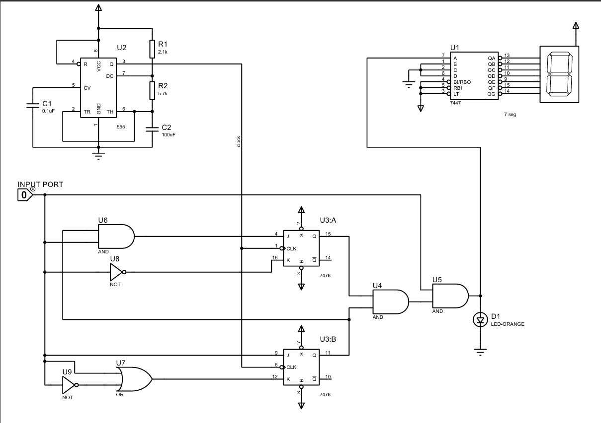

# Mealy Pattern Detector

## Course Name

**Digital Electronics**

## Project Overview

This project implements a Mealy model state machine designed to detect the sequence **1111**  within a 15-bit input stream. The detected result is displayed on a 7-segment common anode display. To simplify the input process, an Arduino Nano is used to generate the **15-bit** input sequence and the clock signal.

The Arduino setup allows users to choose between 4 preloaded sequences or manually input a custom 15-bit sequence using push buttons. The project is tested using simulations in Wokwi and includes a physical implementation on a breadboard.

## Features

- Detects the sequence **1111** in a 15-bit binary input.

- Displays **1** on a 7-segment display if the sequence is found, otherwise displays **0**.

- Provides **4 predefined 15-bit sequences** and supports **manual entry** for a custom sequence.

- Uses an Arduino Nano for clock signal generation and sequence input.

- Includes simulation links, circuit design, and a working demonstration video.

## Components Used

|             Component            |  Quantity |                Description               |
|:--------------------------------:|:---------:|:----------------------------------------:|
| JK Flip-Flops                    | Varies    | Implements the state machine             |
| 7-segment Display (common anode) | 1         | Displays detection result                |
| Arduino Nano                     | 1         | Generates input sequence and clock       |
| Push Buttons                     | 5         | For predefined and manual sequence input |
| LCD Display                      | 1         | Displays current sequence selection      |
| Breadboard                       | 1         | Circuit assembly platform                |
| Connecting Wires                 | As needed | For wiring components                    |

## Functionality

### Input System

- Preloaded Sequences: The Arduino Nano contains 4 predefined 15-bit sequences, selectable via push buttons.

- Manual Sequence Input: Users can create and input a custom 15-bit sequence using additional push buttons.

### Sequence Detection

- When the start button is pressed, the Arduino sends the selected 15-bit sequence to the circuit along with a clock signal.

- If the sequence 1111 is detected within the input, the 7-segment display shows 1; otherwise, it shows 0.

### Output

- 7-Segment Display: Displays 1 for a successful detection or 0 otherwise.

- LCD Display: Shows the selected sequence type (preloaded or manual) for user feedback.

## Circuit Diagram

## Arduino circuit 
 ### [**Wokwi Simulation Link**](https://wokwi.com/projects/403477979726779393)

## Prerequisites

### Arduino IDE

- Breadboard and necessary components

- Basic understanding of Mealy models and state machines

### Implementation

#### 1. Circuit Assembly:
- Simulate in the [**Proteus Simualtion Software**](circuit_simulation\proteus_circuit_simulation_of_a_sequence_detector.pdsprj)  
 
- Assemble the components on the breadboard following the circuit diagram.

- Ensure proper connections for the JK flip-flops, 7-segment display, and Arduino Nano.

#### 2. Arduino Programming:

- Load the [**Arduino code**](15bit_SequenceSender\15bit_SequenceSender.ino) to generate the clock signal and manage sequence inputs.

- Verify functionality for predefined and manual sequences.

#### 3. Testing:

- Test the detection system using the predefined sequences.

- Validate manual sequence input and detection accuracy.

#### 4. Simulation:

- Use the [**Wokwi Simulation Link**](https://wokwi.com/projects/403477979726779393) to test and debug the Arduino setup virtually.

## Demonstration
### **Working Video** 

<video controls width="600">
  <source src="https://drive.google.com/uc?export=download&id=1e9sKfp7f6pbbqBhNI2wa3m3wex3zO72O" type="video/mp4">
  Your browser does not support the video tag.
</video>

## Conclusion 

This project demonstrates the design and implementation of a Mealy model-based sequence detector. The integration of Arduino Nano simplifies input generation, while the use of JK flip-flops ensures accurate sequence detection. The combination of simulation and physical implementation provides a robust and scalable model for detecting patterns in serial inputs.